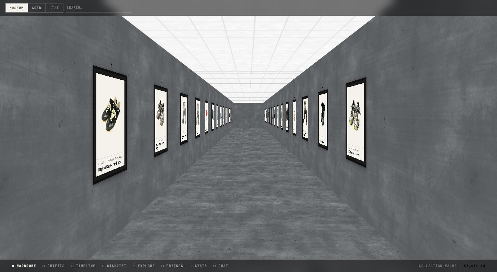
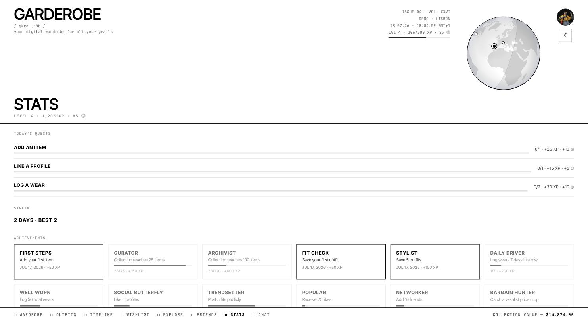
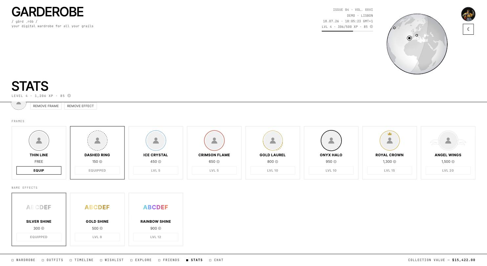
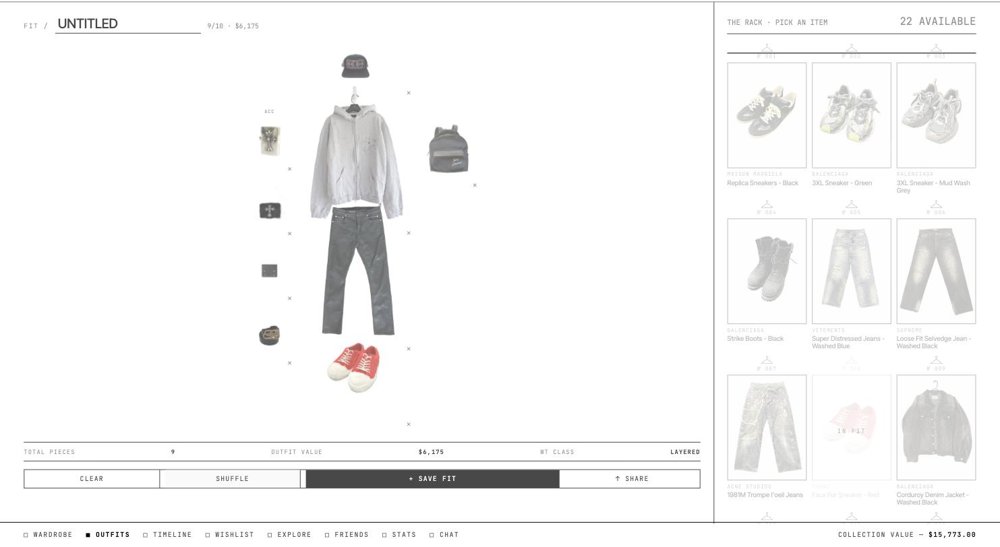
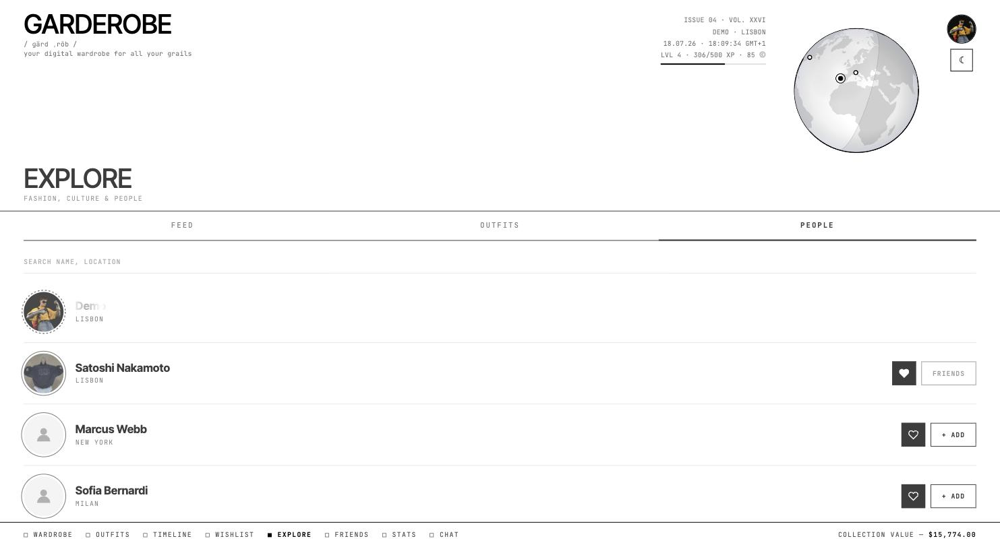

# [GARDEROBE](https://the-garderobe.com)

Your personal wardrobe, reimagined as a living archive — catalog everything you own, build
outfits, track wishlist prices, and level up a full social + gamification layer with friends.
Built as a passion project, fully functional and running in production.


<sub>The Wardrobe as a walkable museum — your collection hung as gallery pieces.</sub>

---

## Highlights

- **Museum wardrobe** — browse your collection as a 3D gallery, or switch to grid/list.
- **AI auto-tagging** — upload a photo and name, brand, color, and type fill in automatically.
- **In-browser background removal** — item photos get cleaned up client-side, no server round trip.
- **Outfit builder** — assemble fits on a visual mannequin; save, shuffle, share.
- **Wishlist with live price tracking** — sources scraped and refreshed on a schedule with delta tracking.
- **Full gamification** — XP, levels, coins, achievements, daily quests, and streaks.
- **Cosmetics shop** — spend coins on profile frames and username effects that render everywhere you appear.
- **Social layer** — friends, likes, an activity feed, profile showcases, and 1:1 chat with presence.
- **Interactive globe** — see where other members are around the world (desktop).

---

## Screens

### Progression — XP, levels, quests & achievements
Earn XP for real activity (adding items, logging wears, saving fits, daily check-ins), level up
for coins, keep a daily streak, and unlock a catalog of achievements.



### Cosmetics shop — frames & username effects
Spend coins on profile frames (Ice Crystal, Gold Laurel, Royal Crown, Angel Wings…) and animated
username effects. Whatever you equip renders everywhere your profile shows up — explore, friends,
chat, and the activity feed.



### Outfit builder
Assemble a fit on the mannequin from your rack, see the total piece count and value, then save it
or post it publicly.



### Explore — people & the globe
Discover public wardrobes, like profiles, and send friend requests; the header globe pins members
by location.



---

## Features in depth

**Wardrobe**
- Add items with photos (HEIC / JPEG / PNG), AI auto-tagging, and automatic background removal
- Museum / grid / list views, filterable by type, color, and brand
- Item detail with wear logging, condition tracking, and pin-to-showcase

**Outfits**
- Visual mannequin builder with click-to-place; save, load, and shuffle fits
- Post fits publicly to the Explore feed; export/share

**Timeline & Wishlist**
- Chronological acquisitions with spend per period
- Wishlist price monitoring across sources (Grailed, SSENSE, …) with scheduled refresh and price deltas

**Gamification**
- XP engine with a level curve; level-ups grant coins; XP toasts + level-up modal
- 14 achievements, 3 rotating daily quests, and a login streak with milestone bonuses
- Cosmetics: profile frames + username effects, bought with coins and gated by level

**Social**
- Friends with accept/decline, profile likes, and fit likes
- A friends **activity feed** (items added, fits posted, achievements unlocked)
- Rich **profile showcase** — level badge, collection value, stats, achievements, cosmetics loadout, and up to 3 pinned items
- **1:1 chat** with shared fit/item/article cards, unread indicators, and online/offline presence
- **Sharing & referrals** — share a fit or article into a chat for rewards; invite links that reward you when a friend joins

**Economy & security**
- All XP / coins / achievements are **server-authoritative** in Postgres — granted by database triggers on real activity, never by the client
- Row-level security throughout; least-privilege on every function

---

## Tech stack

**Frontend** — React (Vite), GSAP for motion, D3-geo + Canvas for the interactive globe,
`@imgly/background-removal` (in-browser ML) for photo cleanup, `heic2any` for iPhone photos.

**Backend / data** — Supabase (Postgres, Auth with MFA, Realtime, Storage). The economy and
social logic live in SQL: SECURITY DEFINER functions, RLS, and triggers. FastAPI handles wishlist
price scraping; a Vercel serverless function runs the Claude AI tagging endpoint.

**AI** — Claude (Anthropic API) auto-tags uploaded clothing from a photo.

---

## Project layout

```
src/                    React app (components, hooks, lib)
backend/                FastAPI price-tracking service
api/                    Vercel serverless functions (AI tagging)
supabase/
  migrations/           Ordered SQL schema (source of truth; see its README)
  functions/            Supabase edge functions
docs/                   Design specs, plans, and screenshots
```

The database schema lives in [`supabase/migrations/`](supabase/migrations/) — ordered, idempotent
SQL that documents every table, policy, and function and can re-provision a fresh environment.

---

## Local development

```bash
npm install
cp .env.example .env.local   # fill in your Supabase + Turnstile keys
npm run dev                  # Vite dev server
npm run lint
npm test                     # unit tests (level-curve + cosmetics parity)
```
